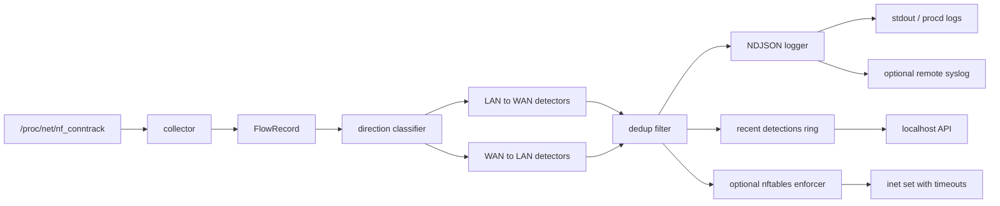

# serpent-wrt

[](https://github.com/ecan0/serpent-wrt/actions/workflows/ci.yml)
[](https://go.dev/)
[](LICENSE)
[](openwrt/serpent-wrt)

Conntrack-only IDS and optional nftables enforcement for OpenWrt routers.

`serpent-wrt` watches lightweight connection metadata that Linux routers already
track, detects suspicious behavior, emits structured security events, and can
optionally block hostile IPs. It is designed for constrained routers: no packet
capture, no payload inspection, no database, and no heavyweight runtime stack.

## Quick Links

- [What problem does this solve?](#what-problem-does-this-solve)
- [What it detects](#what-it-detects)
- [Architecture and data flow](#architecture-and-data-flow)
- [Build and test](#build-and-test)
- [Install on OpenWrt](#install-on-openwrt)
- [Configuration](#configuration)
- [Operate the daemon](#operate-the-daemon)
- [Events and SIEM integration](#events-and-siem-integration)
- [Roadmap](#roadmap)

## What Problem Does This Solve?

Small routers sit at a valuable point in the network: they can see which hosts
are talking to which destinations, and they can enforce blocks close to the edge.
But many IDS and network-monitoring tools are too expensive for common OpenWrt
targets. Packet capture, deep packet inspection, databases, and large agents can
consume CPU, RAM, flash, and operational patience.

`serpent-wrt` takes a narrower path. It reads flow metadata from conntrack, looks
for security-relevant patterns, logs normalized events, and optionally inserts
temporary nftables blocks. The broader cybersecurity goal is practical detection
engineering on limited hardware: useful signals, bounded state, explainable
rules, and safe enforcement defaults.

## Who Is This For?

- OpenWrt users who want lightweight threat visibility on a router.
- Homelab operators sending router detections to Wazuh, Graylog, or syslog.
- Security students learning IDS concepts without starting from packet capture.
- Engineers evaluating constrained-device detection, Go services, and OpenWrt
  packaging.
- Recruiters and hiring managers looking for practical systems/security work:
  flow collection, detector design, operational APIs, CI, packaging, and router
  runtime validation.

## Why Conntrack, Not Packet Capture?

The kernel already maintains a compact connection table through `nf_conntrack`.
Reading that table once per poll cycle is much cheaper than copying every packet
to userspace.

| Capability | Packet capture | Conntrack metadata |
| --- | --- | --- |
| CPU cost | Per packet | Per poll cycle |
| Memory profile | Capture buffers and optional reassembly | Existing kernel flow table |
| Data collected | Payload and headers | Protocol, IPs, ports, state, time |
| Storage pressure | Often paired with PCAP files | None by default |
| Router fit | Heavy on small targets | Lightweight and bounded |
| Enforcement path | Separate integration | Reuses nftables |

This means `serpent-wrt` is intentionally not a full enterprise IDS. It is a
router-friendly detection layer for signals that do not need payload inspection.

## Highlights

- Conntrack-based flow collection with no packet capture.
- Direction-aware detection for LAN-to-WAN and WAN-to-LAN traffic.
- Local IPv4/IP-CIDR threat feed with SIGHUP/API reload.
- Six detectors: `feed_match`, `fanout`, `port_scan`, `beacon`, `ext_scan`, and
  `brute_force`.
- Broadcast, loopback, link-local, unroutable, and router-self filtering.
- Config-only suppression rules for expected scanners, monitors, and other
  noisy but trusted traffic.
- Detection profiles (`home`, `homelab`, `quiet`, `paranoid`) for practical
  threshold tuning without editing every detector.
- Deduplication to suppress repeated alerts while preserving meaningful
  destination-port differences.
- Structured NDJSON logs with severity, confidence, and reason metadata.
- Optional remote syslog forwarding for SIEM ingestion.
- Optional nftables blocking through named sets, kernel-managed timeouts, and
  status diagnostics for missing enforcement state.
- Localhost HTTP API for health, status, stats, reloads, detections, and blocks.
- OpenWrt package scaffold, procd init script, and CI runtime smoke coverage.

## What It Detects

All detections use connection metadata only. No payloads are inspected.

| Direction | Detector | Signal |
| --- | --- | --- |
| LAN to WAN | `feed_match` | Internal host contacts an IP/CIDR in the threat feed. |
| LAN to WAN | `fanout` | Internal host reaches too many distinct external destinations. |
| LAN to WAN | `port_scan` | Internal host probes many ports on one external target. |
| LAN to WAN | `beacon` | Internal host contacts the same destination on a regular cadence. |
| WAN to LAN | `feed_match` | Known-bad external source reaches an internal host. |
| WAN to LAN | `ext_scan` | External source probes many ports on one internal host. |
| WAN to LAN | `brute_force` | External source hits the same service port across many internal hosts. |

Detections include a stable `reason`, a severity, and a confidence score so
downstream rules can distinguish threat-feed hits, scans, service sprays, and
beacon-like behavior.

## Architecture And Data Flow



Design invariants:

- bounded in-memory state
- no packet capture or deep packet inspection
- no persistent database
- detect-only by default
- IPv4-only for the current MVP
- safe operation on common OpenWrt targets

This section is also the future home for richer diagrams: project structure,
detection lifecycle, OpenWrt package flow, procd lifecycle, and SIEM forwarding.
If those grow beyond README size, they should move to `docs/architecture.md` or
`docs/diagrams/` with links kept here.

## Build And Test

```sh
# Native build
make build

# Run tests
make test

# Cross-build representative OpenWrt targets
make cross

# Print build metadata
./bin/serpent-wrt -version
```

Windows workspace note for local development:

```powershell
. .\.env.local.ps1
go test ./...
go vet ./...
git diff --check
```

Supported build targets include `linux/mipsle`, `linux/mips`, `linux/arm`
(v5/v7), `linux/arm64`, `linux/riscv64`, `linux/386`, and `linux/amd64`.

OpenWrt x86/generic images often report `i686`; use `GOARCH=386`, not `amd64`,
for that target.

## Install On OpenWrt

### Package scaffold

The OpenWrt package scaffold lives in [openwrt/serpent-wrt](openwrt/serpent-wrt).
It is intended for a custom feed today. Before a tagged release, validate it in
a real OpenWrt SDK and refresh package source metadata. Public release
packaging should use a final commit or tag source and a fixed source hash rather
than the development `PKG_MIRROR_HASH:=skip` setting.

```sh
# From an OpenWrt SDK/buildroot with this package added to a feed:
./scripts/feeds update -a
./scripts/feeds install serpent-wrt
make package/serpent-wrt/check V=s
make package/serpent-wrt/compile V=s
```

### Lab/manual deploy

```sh
# Current lab VM is x86/generic, so this builds a 32-bit x86 binary.
make deploy-x86 DEPLOY_HOST=root@<openwrt-host>
```

Manual install path:

```sh
ssh root@router 'mkdir -p /etc/serpent-wrt'

ssh root@router 'cat > /usr/sbin/serpent-wrt && chmod 0755 /usr/sbin/serpent-wrt' \
  < bin/serpent-wrt-openwrt-x86

ssh root@router 'cat > /etc/init.d/serpent-wrt && chmod 0755 /etc/init.d/serpent-wrt' \
  < openwrt/serpent-wrt/files/serpent-wrt.init

ssh root@router 'cat > /etc/serpent-wrt/serpent-wrt.yaml' \
  < openwrt/serpent-wrt/files/serpent-wrt.yaml

ssh root@router 'cat > /etc/serpent-wrt/threat-feed.txt' \
  < openwrt/serpent-wrt/files/threat-feed.txt

ssh root@router '/etc/init.d/serpent-wrt enable && /etc/init.d/serpent-wrt start'
```

## Configuration

See [configs/serpent-wrt.example.yaml](configs/serpent-wrt.example.yaml) for an
annotated configuration.

Minimal shape:

```yaml
poll_interval: 5s
threat_feed_path: /etc/serpent-wrt/threat-feed.txt
profile: home

enforcement_enabled: false
block_duration: 1h

lan_cidrs:
  - 192.168.1.0/24

self_ips:
  - 192.168.1.1

nft_table: serpent_wrt
nft_set: blocked_ips

api_enabled: true
api_bind: 127.0.0.1:8080

dedup_window: 5m

suppression_rules:
  - name: trusted scanner
    detectors: [port_scan, ext_scan]
    src_addrs:
      - 192.168.1.50
  - name: external SSH health check
    detectors: [brute_force]
    src_addrs:
      - 198.51.100.10/32
    dst_ports: [22]

detectors:
  fanout:
    distinct_dst_threshold: 50
    window: 60s
  scan:
    distinct_port_threshold: 30
    window: 60s
  beacon:
    min_hits: 5
    tolerance: 3s
    window: 5m
  ext_scan:
    distinct_port_threshold: 15
    window: 60s
  brute_force:
    threshold: 5
    window: 60s
```

Important fields:

- `lan_cidrs` tells the daemon which flows are outbound vs inbound.
- `profile` applies detector defaults for common operating modes. `home`
  preserves the baseline defaults, `homelab` and `quiet` raise thresholds for
  noisier networks, and `paranoid` lowers thresholds for more aggressive
  alerting. Explicit detector settings always override profile defaults.
- `self_ips` prevents router-originated management, NTP, DHCP, and similar
  traffic from becoming detections.
- `enforcement_enabled` defaults deployments toward detect-only operation.
- `nft_table` and `nft_set` must use conservative nft identifiers: letters,
  numbers, and underscores, with a letter or underscore first.
- `dedup_window` suppresses repeated alerts from the same detector/source/target
  combination.
- `suppression_rules` suppress expected detections before logging, recent-event
  storage, stats-by-type increments, or enforcement. Each rule matches only when
  every configured dimension matches. Supported matchers are `detectors`,
  `src_addrs`, `dst_addrs`, and `dst_ports`; address matchers accept IPv4
  addresses or CIDRs.
- `syslog_target` and `syslog_proto` can forward JSON events to a SIEM.

## Operate The Daemon

Common OpenWrt commands:

```sh
/etc/init.d/serpent-wrt start
/etc/init.d/serpent-wrt stop
/etc/init.d/serpent-wrt restart
/etc/init.d/serpent-wrt status
/etc/init.d/serpent-wrt configtest
/etc/init.d/serpent-wrt reload_feed
```

Validate the YAML config and referenced threat feed before starting or
reloading:

```sh
serpent-wrt configtest
serpent-wrt --config /etc/serpent-wrt/serpent-wrt.yaml configtest
```

Hot-reload the threat feed without restarting:

```sh
kill -HUP "$(pidof serpent-wrt)"
```

HTTP API, available when `api_enabled: true`:

| Endpoint | Method | Purpose |
| --- | --- | --- |
| `/healthz` | GET | Liveness check. |
| `/status` | GET | Feed count/path, enforcement/nft diagnostics, uptime, detector config, build metadata. |
| `/stats` | GET | Flow, detection, suppression, and block counters. |
| `/detections/recent` | GET | Last 100 detections in memory. |
| `/blocked` | GET | Current nftables blocked set contents. |
| `/reload` | POST | Reload threat feed from disk. |
| `/feed` | GET | List normalized local threat feed entries. |
| `/feed` | PUT | Replace the local threat feed with validated entries. |
| `/feed/validate` | POST | Validate one entry or a candidate entry list without writing. |
| `/feed/add` | POST | Add one IPv4/IP-CIDR feed entry and reload if changed. |
| `/feed/remove` | POST | Remove one feed entry and reload if changed. |

Example:

```sh
curl http://127.0.0.1:8080/status
curl -X POST http://127.0.0.1:8080/reload
curl http://127.0.0.1:8080/feed
curl -X POST http://127.0.0.1:8080/feed/add \
  -d '{"entry":"198.51.100.1"}'
curl -X PUT http://127.0.0.1:8080/feed \
  -d '{"entries":["198.51.100.1","203.0.113.0/24"]}'
```

## Events And SIEM Integration

Events are newline-delimited JSON on stdout and can also be forwarded to remote
syslog.

```json
{"time":"2026-01-01T00:00:00Z","level":"info","type":"system","component":"feed","action":"reload","status":"success","feed_count":42,"message":"reloaded threat feed: 42 entries"}
{"time":"2026-01-01T00:00:01Z","level":"warn","type":"detection","detector":"feed_match","severity":"high","confidence":95,"reason":"threat_feed_destination","src_ip":"192.168.1.5","dst_ip":"1.2.3.4","dst_port":443,"message":"connection to threat feed entry 1.2.3.4"}
{"time":"2026-01-01T00:00:02Z","level":"warn","type":"enforcement","src_ip":"192.168.1.5","message":"blocked 192.168.1.5 triggered by feed_match"}
```

Wazuh decoder and rules live in [contrib/wazuh](contrib/wazuh). They cover the
detector names used by `serpent-wrt` and are meant to be copied into a Wazuh
deployment alongside syslog forwarding.

## Enforcement Safety

`serpent-wrt` is detect-only unless `enforcement_enabled: true`.

When enforcement is enabled, detections can add IPv4 addresses to a named
nftables set with a timeout. The kernel expires those entries; the daemon also
keeps a bounded local map so it avoids repeatedly adding the same IP.

On OpenWrt, firewall4 (`fw4`) owns the generated firewall ruleset. `serpent-wrt`
uses its own `inet` table and set for dynamic blocks; do not point it at a
fw4-managed table unless you are deliberately integrating custom firewall
includes. After a firewall reload, check `/status`: `check_state` reports
`missing_table` or `missing_set` if fw4 removed the enforcement resources.
Restart `serpent-wrt` before relying on enforcement so the daemon can recreate
its table and set.

Before enabling enforcement on a real router:

1. Confirm `/status` reports nft availability, setup state, and `check_state:
   ready`.
2. Confirm your firewall policy uses the `nft_table` and `nft_set` you expect.
3. Start with a short `block_duration`.
4. Keep console or SSH access available for rollback.
5. Disable enforcement by setting `enforcement_enabled: false` and restarting.

## Threat Feed Format

Plain text, one IPv4 address or CIDR per line. Blank lines and comments are
ignored. IPv6 entries are ignored in the current MVP.

```text
# example
1.2.3.4
185.220.101.0/24
```

## Project Layout

```text
cmd/serpent-wrt/        CLI entrypoint and build metadata
internal/api/           localhost management API
internal/collector/     conntrack collection and parsing
internal/config/        YAML config loading and validation
internal/detector/      feed, scan, fanout, beacon, and inbound detectors
internal/enforcer/      nftables command integration
internal/events/        NDJSON and syslog event logging
internal/feed/          local threat feed parser
internal/runtime/       detection pipeline, status, stats, and recent events
openwrt/serpent-wrt/    OpenWrt package scaffold
contrib/wazuh/          Wazuh decoder and rules
docs/                   release and operational documentation
```

## Roadmap

### v0.1 status

The daemon/API is release-candidate ready for a first lightweight tag:

- `configtest` and procd start/reload validation.
- Runtime smoke checks for `configtest`, API health, `/status`, `/stats`,
  `/reload`, service reload, and service restart.
- nft command construction tests and fw4 ownership documentation.
- Local feed management API for bounded list, validate, add, remove, and replace
  operations.
- Changelog and release documentation for v0.1.0.

Before wider OpenWrt package publication:

- Validate the package scaffold in a real OpenWrt SDK/buildroot.
- Replace the custom-feed source pin and `PKG_MIRROR_HASH:=skip` with final
  release source metadata and a fixed hash.

### Strong candidates after v0.1

- Additional Wazuh rules for structured system events.
- Operational runbook for install, detect-only mode, enforcement, and rollback.

### Explicitly post-MVP

- Netlink conntrack prototype.
- IPv6 first-class detection and enforcement.
- dnsmasq hostname correlation.
- Remote threat feed sync.
- LuCI UI.
- eBPF/XDP experiments on capable targets.

## Limitations

- IPv4 only for MVP.
- Polling instead of netlink events.
- No DNS/hostname correlation.
- No payload inspection by design.
- No persistent database or historical UI.
- Local threat feed only.
- Enforcement currently shells out to `nft`.

## Development

```sh
go test ./...
go vet ./...
git diff --check
make build-openwrt-targets
```

Runtime lab validation is available through:

```sh
make deploy-x86 DEPLOY_HOST=root@<openwrt-host>
```

The OpenWrt smoke test validates `configtest`, API liveness, `/status`, `/stats`,
`/reload`, and service reload/restart behavior against the deployed daemon.

See [CONTRIBUTING.md](CONTRIBUTING.md), [SECURITY.md](SECURITY.md), and
[docs/release.md](docs/release.md) for project workflow, security reporting, and
release steps.

## License

[MIT](LICENSE)
