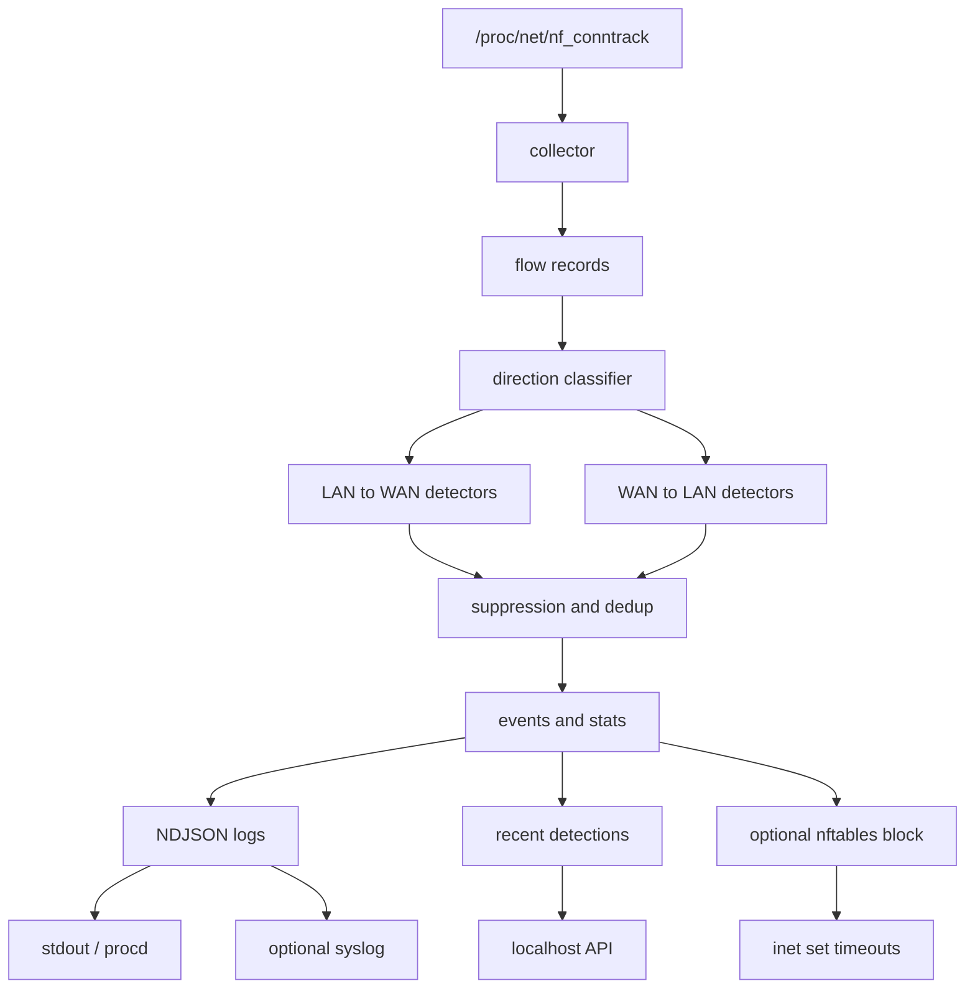

# serpent-wrt

<p align="center">
  
  <br>
  
</p>
<br>

[](https://github.com/ecan0/serpent-wrt/actions/workflows/ci.yml)
[](https://go.dev/)
[](LICENSE)
[](openwrt/serpent-wrt)

`serpent-wrt` is a lightweight OpenWrt/Linux IDS for router-safe detection,
local threat-intel matching, structured security events, and optional nftables
blocking.

It reads conntrack metadata that Linux routers already maintain. It does not
capture packets, inspect payloads, run a database, or require a heavyweight
agent stack.

## What It Does

- Watches `nf_conntrack` flow metadata.
- Matches flows against a local IPv4/IP-CIDR threat feed.
- Detects feed hits, fanout, port scans, beacon-like traffic, inbound scans,
  and brute-force/service-spray patterns.
- Emits NDJSON security events and optional remote syslog.
- Exposes a localhost API for health, status, stats, recent detections, feed
  management, reloads, and current blocks.
- Optionally adds hostile IPs to nftables sets with kernel-managed timeouts.
- Ships OpenWrt package metadata, procd init files, release APK artifacts, and
  runtime smoke coverage.

## Quick Start

Build and test locally:

```sh
make build
make test
make release-check
./bin/serpent-wrt -version
```

Manual daemon starts print a terminal banner on interactive stderr. Use
`--banner always` for demos and screenshots, or `--banner never` for scripts.

Validate a config:

```sh
serpent-wrt --config configs/serpent-wrt.example.yaml configtest
serpent-wrt --config configs/serpent-wrt.example.yaml configtest --effective
```

Run on OpenWrt with the package artifacts from the latest release, or deploy a
local cross-build to a test router:

```sh
make cross
make deploy-x86 DEPLOY_HOST=root@openwrt-target
```

OpenWrt x86/generic targets usually need the 32-bit x86 build (`GOARCH=386`).

## Architecture


```mermaid
flowchart TD
    A["/proc/net/nf_conntrack"] --> B["collector"]
    B --> C["flow records"]
    C --> D["direction classifier"]
    D --> E["LAN to WAN detectors"]
    D --> F["WAN to LAN detectors"]
    E --> G["suppression and dedup"]
    F --> G
    G --> H["events and stats"]
    H --> I["NDJSON logs"]
    H --> J["recent detections"]
    H --> K["optional nftables block"]
    I --> L["stdout / procd"]
    I --> M["optional syslog"]
    J --> N["localhost API"]
    K --> O["inet set timeouts"]
```

Design guardrails:

- bounded in-memory state
- detect-only by default
- no packet capture or payload inspection
- no persistent database
- polling remains the stable collector path
- IPv4-only in current releases

More detail: [Architecture](docs/architecture.md).

## Detection Coverage

| Detector | Direction | Practical signal |
| --- | --- | --- |
| `feed_match` | LAN to WAN / WAN to LAN | Known-bad IP or CIDR contact. |
| `beacon` | LAN to WAN | Regular repeated contact with one destination. |
| `fanout` | LAN to WAN | One host reaches many distinct external destinations. |
| `port_scan` | LAN to WAN | One host probes many ports on one external target. |
| `ext_scan` | WAN to LAN | External source probes many ports on one internal host. |
| `brute_force` | WAN to LAN | External source hits the same service across many hosts. |

Detections include stable reasons, severity, confidence, and optional host/MAC
enrichment from dnsmasq leases.

## OpenWrt APKs

The `OpenWrt APK Packages` workflow builds release APKs from official OpenWrt
25.12 SDKs and attaches target-specific packages plus `SHA256SUMS` files to
GitHub Releases.

Current release assets:

- `serpent-wrt-0.3.1-r4-x86-64.apk`
- `serpent-wrt-0.3.1-r4-x86-generic.apk`
- `serpent-wrt-0.3.1-r4-mediatek-filogic.apk`

Install and package details: [OpenWrt install](docs/openwrt-install.md).

## Configuration And Operation

Start with [configs/serpent-wrt.example.yaml](configs/serpent-wrt.example.yaml).

Common commands:

```sh
/etc/init.d/serpent-wrt start
/etc/init.d/serpent-wrt status
/etc/init.d/serpent-wrt configtest
/etc/init.d/serpent-wrt nftcheck
/etc/init.d/serpent-wrt reload_feed
```

Threat feed management:

```sh
serpent-wrt feed list
serpent-wrt feed validate
serpent-wrt feed add 198.51.100.1
serpent-wrt feed remove 198.51.100.1
```

Reference docs:

- [Configuration](docs/configuration.md)
- [HTTP API](docs/api.md)
- [Threat feeds](docs/threat-feeds.md)
- [OpenWrt runbooks](docs/openwrt-runbooks.md)
- [Release process](docs/release.md)
- [Roadmap](docs/roadmap.md)

## Events And SIEM

Events are newline-delimited JSON on stdout and can also be forwarded to remote
syslog.

```json
{"time":"2026-01-01T00:00:01Z","level":"warn","type":"detection","detector":"feed_match","severity":"high","confidence":95,"reason":"threat_feed_destination","src_ip":"198.51.100.5","dst_ip":"203.0.113.4","dst_port":443}
```

Wazuh decoder and rules live in [contrib/wazuh](contrib/wazuh).

## Safety And Limits

- Enforcement is disabled unless `enforcement_enabled: true`.
- nftables blocks use named sets and timeouts; the kernel expires entries.
- OpenWrt firewall reloads can remove custom nftables state, so check
  `/status` or run `nftcheck` before relying on enforcement.
- IPv6, packet capture, persistent storage, dashboards, ML scoring, and remote
  feed sync are outside the current release scope.

## Development

Development flows through `dev`; `main` is the protected release and tag branch.
Use `feature/<slice-name>` for product work and `ci/<slice-name>` for CI,
release, docs/process, and automation work.

Useful checks:

```sh
go test ./...
go vet ./...
git diff --check
make release-check
```

Project workflow and release guidance:

- [CONTRIBUTING.md](CONTRIBUTING.md)
- [SECURITY.md](SECURITY.md)
- [docs/release.md](docs/release.md)

## License

[MIT](LICENSE)
