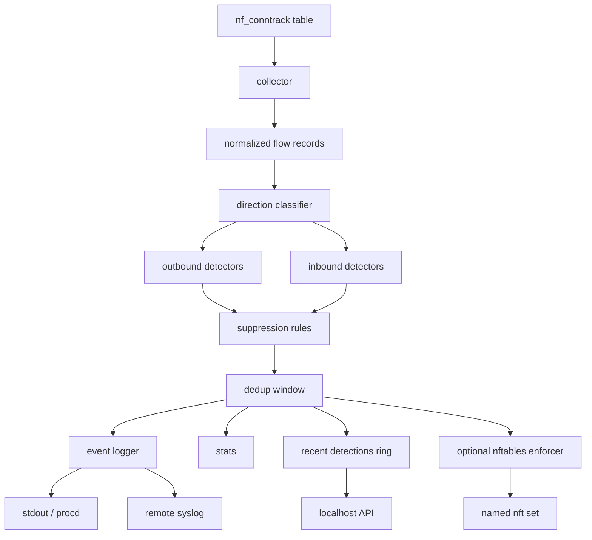

# Architecture

`serpent-wrt` is built for constrained OpenWrt routers. It favors bounded
metadata analysis over packet capture, payload inspection, or persistent
storage.

## Why Conntrack

Linux already maintains connection metadata through `nf_conntrack`. Reading
that table once per poll cycle is cheaper than copying every packet to
userspace.

| Capability | Packet capture | Conntrack metadata |
| --- | --- | --- |
| CPU cost | Per packet | Per poll cycle |
| Memory profile | Capture buffers and optional reassembly | Existing kernel flow table |
| Data collected | Payload and headers | Protocol, IPs, ports, state, time |
| Storage pressure | Often paired with PCAP files | None by default |
| Router fit | Heavy on small targets | Lightweight and bounded |
| Enforcement path | Separate integration | Reuses nftables |

## Flow

## Collection Semantics

The collector reads a snapshot of the current conntrack table. It does not
receive packet events or authoritative connection-create events. Distinct-value
detectors tolerate repeated snapshots of the same entry, but the beacon detector
uses eligible observations as cadence samples. A long-lived UDP entry or a TCP
entry that remains in a non-established state can therefore look periodic at the
poll interval. Treat beaconing as an experimental lead, tune `exclude_ports`,
and validate it against representative router traffic before coupling it to a
response policy.

## Enforcement Boundary

When `enforcement_enabled` is true, the daemon creates the configured inet table
and timed IPv4 set, then adds detected source addresses to that set. It does not
create a base chain or packet-drop rule. An operator-managed firewall policy must
reference the set before entries affect traffic. `/blocked`,
`blocks_applied`, and nft readiness report successful set management, not proof
that packets were dropped.

For OpenWrt, a supported fw4 package include is the preferred future integration
instead of ad hoc runtime rules. Until that integration exists, verify the full
ruleset and an actual packet-flow test before describing enforcement as active.

## Detectors

| Detector | Direction | Security outcome |
| --- | --- | --- |
| `feed_match` | LAN to WAN | Internal host contacts a listed IP/CIDR. |
| `feed_match` | WAN to LAN | Known-bad external source reaches an internal host. |
| `beacon` | LAN to WAN | Host contacts the same destination on a regular cadence. |
| `fanout` | LAN to WAN | Host reaches too many distinct external destinations. |
| `port_scan` | LAN to WAN | Internal host probes many ports on one external target. |
| `ext_scan` | WAN to LAN | External source probes many ports on one internal host. |
| `brute_force` | WAN to LAN | External source hits the same service port across many internal hosts. |

Detections include a stable `reason`, severity, and confidence score so SIEM
rules can distinguish threat-feed hits, scans, service sprays, and beacon-like
traffic.

## Invariants

- Bounded in-memory state.
- Detect-only by default.
- No packet capture or payload inspection.
- No persistent database.
- IPv4 and IPv6 flow metadata are supported.
- Polling remains the stable fallback even if an optional netlink collector is
  added later.
